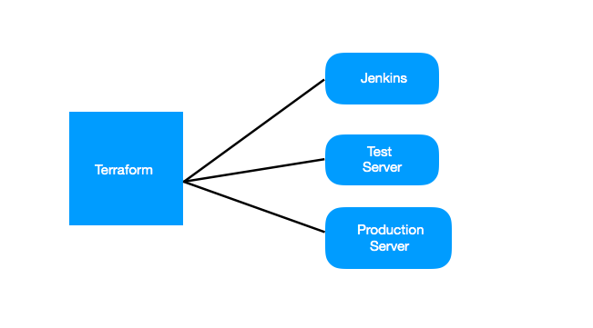
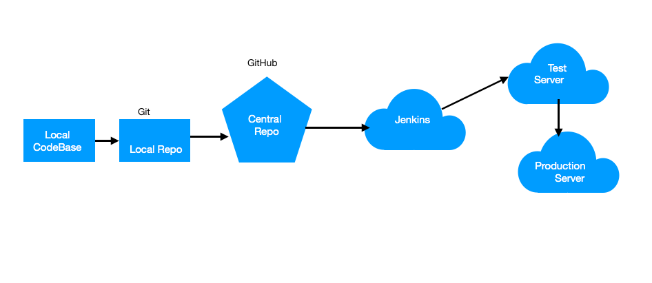

# CI-CD-Container-based-project
Insight Data Engineering - 3 week sprint project.

# Jenkins test:
testing jenkins auto build trigger on 08,10.2018
1..2..3..
06.18.2018, testing webhook from feature branch
testing again after setting up webhook fully again
08.19.2018: 1..2..3..testing jenkins webhook on 08.19.2018 for demo video..
# Project Idea:

Create platform independant continuous integration/ continous deployment(CI/CD) pipeline on aws ec2.

# Purpose:

Continuously integrate and deploy Docker container in Stagging and Production Server.

Imagine I work in a ecommerce company. The website has nginx as front end,postgres as backend and flask app as application server. Developers use git and push their code to Github.
1. By CI/CD, the integration hell is minimised.
    "Integrate early and integrate often" - slogan for CI/CD practice.
2. By using docker containers, the platform independance is achieved.
3. By using docker-compose:
    Very simple way to orchestor containers.
    Acts like a Configuration manager and it is very easy to update dependancies.
4. By using IaC:
    Easy to set up the infrastructure for jenkins,Stagging and Production Server.

# Technologies Suited for the challenge:

   1. Terraform
   2. Docker, Docker compose
   3. Jenkins
   4. Github(webhook)
   5. AWS EC2 instances.(3)

# Proposed Architecture:

